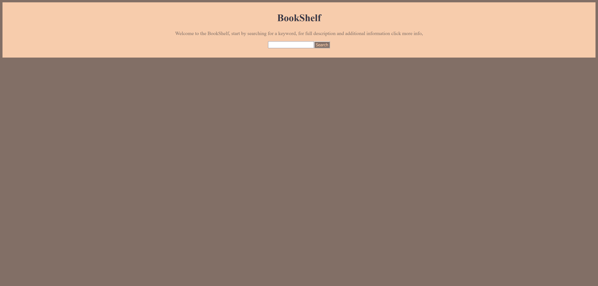
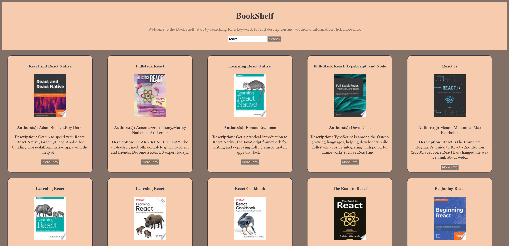

# google-books-project

Link

# Screenshots

# Description

Using the Google Books API uses the input value as a query string to fetch the relevant data and display data dynamically into a book card on a grid, full description and additional information displyed on a modal when the more info button is pressed.

# Requirements

1. Create a page that allows users to search for books
2. Page should include the following:

-   Header section introducing the page
-   Form containing a text input and a submit / search button
-   A grid of books

Instructions:

-   When the submit button is clicked you need the request books from the Google books API using the input value as your query string
-   The books that you receive should be rendered in the books grid.
-   Each book in the grid should have an image, author, title and description
-   The grid should be responsive on different screen sizes
-   You should use async / await for your request code, NOT .then

Styling (required):

-   This application should look good, take some time to pick a palette and plan out your design. You can use tools like Figma or wireframe pro to plan what your application is going to look like.
-   Styling must use BEM, and each block should have its own SCSS file
-   Your palette should use variables

Application Design (required):

-   You should separate DOM functions and non-DOM functions in different modules. (Non-React)
-   Write as many non-DOM functions as you can. (Non-React)
-   Functions should do 1 thing, and should be as pure and reusable as possible.
-   Always use iterators over loops.
-   Always parametrize and abstract large pieces of duplicate code.

Bonus (optional, but highly recommended):

-   Use React for the frontend.
-   Give feedback to the user when no book results can be found for the query.
-   When a user clicks a book in the grid, a modal should appear with more book information, think about release, publish date, country, languages, etc.

# Implementation Details

## Technology

-   React
-   API (Google Books)
-   SCSS
-   Material-UI
-   Javascript
-   Git & Github

## Design

A simple easy to use responsive single page design, displaying the fetched data dymnatically on individual book cards on a grid wit a more info button to display additional information and the full description for books with longer descriptions.

#### Limitations

1. Some of the fetched data did not have the relevant keys I wanted e.g. images or descriptions, as this data was a requirement I did not render these cards to the app.

2. I selected my first colour palette using an old external monitor while I was travelling, the colours did not actually look as expected and as a result I made my next selection using my laptop's built-in display which is extremely more acolour accruate.

## Lifecycle

-   Project was delivered feature at a time on seperate branches, starting with javascript logic before introducing DOM manipulation and merged with the main branch after review.
-   Project was created with a modular approach, seperating logic and DOM in modules.

# In The Future

### What I have learnt from this project

- Be more cautious of colour inaccuracy when using  foreign old external displays.

